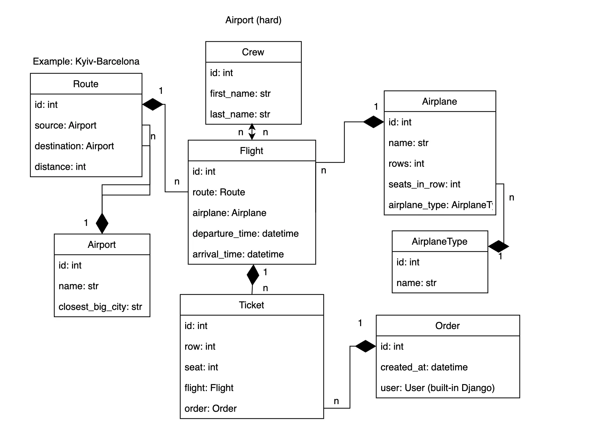

# AirLink API

AirLink API is a flight management system built with Django REST Framework. It provides endpoints for managing airlines, airports, flights, and bookings.

## Features

- User authentication and authorization
- CRUD operations for airplane types, airplanes, airports, crew, routes, flights, and orders
- JWT-based authentication

## Installation

### Prerequisites

- Python 3.8+
- PostgreSQL
- Docker (optional)

### Installing using GitHub

1. Clone the repository:
git clone https://github.com/jpdreamthug/AirLink-API.git
2. Change into the project directory:
cd AirLink-API
3. Create a virtual environment:
python -m venv venv
4. Activate the virtual environment:
- On Windows:
  ```
  venv\Scripts\activate
  ```
- On macOS and Linux:
  ```
  source venv/bin/activate
  ```
5. Install the required dependencies:
pip install -r requirements.txt
6. Set up the PostgreSQL database and update the `.env` file with your database credentials.Check `.env.sample`
7. Apply migrations:
python manage.py migrate
8. Run the development server:
python manage.py runserver
9. The API will be available at `http://localhost:8000`.

### Running with Docker

1. Make sure you have Docker and Docker Compose installed.
2. Build and run the containers:
docker-compose up --build
The API will be available at `http://localhost:8001`.

### Authentication

To use the API, you need to create a user account and obtain an access token:

1. Create a user:
POST /user/register/
2. Get an access token:
POST /user/token/
Include the access token in the Authorization header for authenticated requests:
Authorization: Bearer <your_access_token>
### API Endpoints

#### User Management
- `POST /user/register/` - Register a new user
- `POST /user/token/` - Obtain JWT token
- `POST /user/token/refresh/` - Refresh JWT token
- `POST /user/token/verify/` - Verify JWT token
- `GET /user/me/` - Retrieve or update the authenticated user

#### AirLink API (prefix: `/api/v1/`)
- `/airplane-types/` - List and create airplane types
- `/airplanes/` - List and create airplanes
- `/airports/` - List and create airports
- `/crew/` - List and create crew members
- `/routes/` - List and create routes
- `/flights/` - List and create flights
- `/orders/` - List and create orders

For detailed API documentation, visit `/api/schema/swagger-ui/` when the server is running.

## Admin Interface

The Django admin interface is available at `/admin/`. You can use it to manage the database entries directly.

## Debug Toolbar

The Django Debug Toolbar is included in the project. It's automatically added to the URL patterns when in debug mode.
